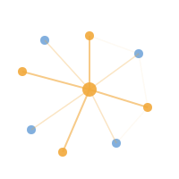
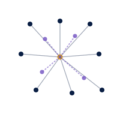

El Grupo de Redes Sociales – UC contribuye más allá de la academia a través de educación continua, asesorías y una alianza activa con la comunidad chilena de ciencia de redes sociales — llevando métodos de redes rigurosos a decisiones organizacionales y de política pública reales.

::: {.snuc-stats}

11Áreas de investigación

4Proyectos de investigación activos

5Países en nuestra red

:::

## Educación y Capacitación

### Diplomado en Inteligencia Relacional para Organizaciones

Formación profesional para múltiples sectores · Mayo – Diciembre

Un programa de diplomado integral para profesionales de disciplinas diversas — gestión de personas, comunicaciones, innovación, consultoría, desarrollo organizacional, asuntos públicos, investigación social y emprendimiento. Aprende a comprender, medir y visualizar estructuras relacionales en organizaciones y ecosistemas de colaboración, desde redes informales de influencia hasta circulación de conocimiento y posicionamiento estratégico. Se ofrece sujeto a cantidad suficiente de participantes.

También ofrecemos cursos y talleres especializados sobre análisis de redes sociales, modelamiento estadístico de redes, métodos computacionales y análisis de redes organizacionales — diseñados para profesionales y organizaciones de todos los sectores que deseen aprovechar la ciencia de redes para la colaboración, innovación y toma de decisiones estratégicas.

## Asesorías y Consultoría

### Lleva el análisis de redes a tu organización

Diagnósticos, capacitación y colaboraciones de investigación aplicada

Estamos abiertos a trabajos de asesoría y consultoría que apliquen el análisis de redes a contextos organizacionales, gubernamentales y de la sociedad civil — mapeando estructuras de colaboración, diagnosticando redes de gobernanza y diseñando intervenciones basadas en datos. Si tu organización está interesada en un diagnóstico o colaboración, [contáctanos](contacto.qmd).

## Alianza

### CHISOCNET — Sociedad Chilena de Ciencia de Redes Sociales

<a href="https://www.chisocnet.org">chisocnet.org</a>

El Grupo de Redes Sociales – UC es socio activo de CHISOCNET, que busca desarrollar la ciencia de redes sociales en Chile como un campo de referencia internacional para Iberoamérica, a través de conferencias, seminarios y una escuela de verano.

